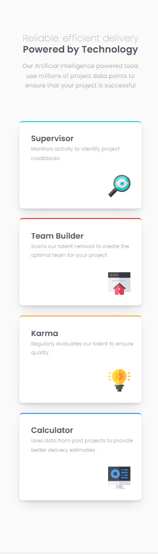

# Frontend Mentor - Four card feature section solution

This is a solution to the [Four card feature section challenge on Frontend Mentor](https://www.frontendmentor.io/challenges/four-card-feature-section-weK1eFYK). Frontend Mentor challenges help you improve your coding skills by building realistic projects. 

## Table of contents

- [Overview](#overview)
  - [The challenge](#the-challenge)
  - [Screenshot](#screenshot)
  - [Links](#links)
- [My process](#my-process)
  - [Built with](#built-with)
  - [What I learned](#what-i-learned)
  - [Continued development](#continued-development)
  - [Useful resources](#useful-resources)
- [Author](#author)
- [Acknowledgments](#acknowledgments)

**Note: Delete this note and update the table of contents based on what sections you keep.**

## Overview

### The challenge

Users should be able to:

- View the optimal layout for the site depending on their device's screen size

### Screenshot

### Links

- Solution URL: [Click here](https://github.com/neo2enigma/four-card-feature-section-master)
- Live Site URL: [Click here](https://neo2enigma.github.io/four-card-feature-section-master/)

## My process

### Built with

- Semantic HTML5 markup
- CSS custom properties
- CSS Grid
- Mobile-first workflow
- [CSS Grid](https://www.w3schools.com/css/css_grid.asp) - CSS Grid

### What I learned

Flowing into 2 different direction, along deep understanting how to layout elements in a grid is a new challenge. One vital thing is, before coding for grid:
1- Imaging the normal flow of elements, assuming they suppose to flow in one direction.
2- Draw your design in a piece of paper, try to find how each element spans over other grid cells! 

### Useful resources

- [A Complete Guide to Grid](https://css-tricks.com/snippets/css/complete-guide-grid/) - This helped me to undestand grids deeply.

## Author

- Linkedin - [@kamran-safaei](https://www.linkedin.com/in/kamran-safaei/)